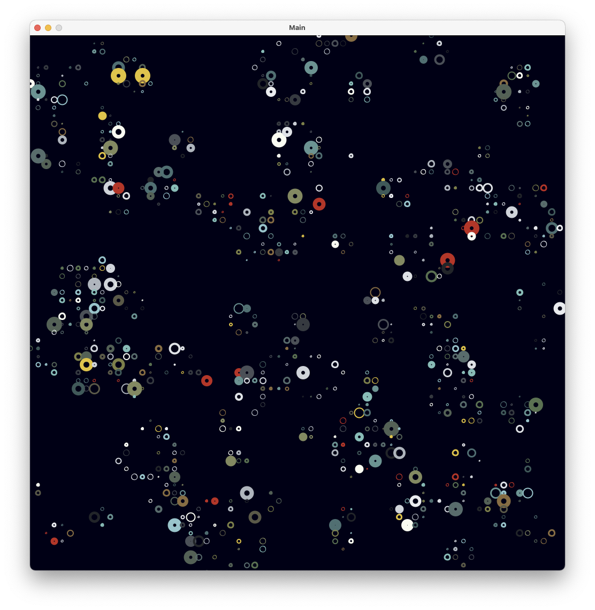

# Syntlife

Quick experiment on coupling a game of life with synthetizer. Colors of the cells is based on an underlying image.

    
  </a>

## Installation and running 

Clone the repo and launch using your IDE. Make sure that processing library is loaded in classpath.

## Origins & License

Code and documentation copyright 2023. Code and documentation released under creativecommons.